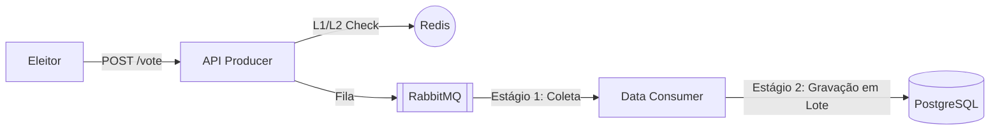

# 🗳️ Ecossistema do Sistema de Votação

Uma plataforma de votação de alta performance, segura e distribuída, projetada para processar milhares de votos por segundo com validação em sub-milissegundos.

## 📐 A Arquitetura

Este projeto é dividido em dois microsserviços especializados que se comunicam de forma assíncrona via **RabbitMQ**:

1.  **[API Producer (Produtor)](file:///c:/Users/Gerson%20Firmino/Desktop/r/backctulho/api/README.md)**: A porta de entrada. Gerencia o tráfego HTTP, bloqueios de segurança (Rate Limit) e desduplicação ultra-rápida usando Redis.
2.  **[Data Consumer (Consumidor)](file:///c:/Users/Gerson%20Firmino/Desktop/r/backctulho/dados/README.md)**: O motor. Extrai mensagens do RabbitMQ usando um pipeline de múltiplos canais e as persiste no PostgreSQL em lotes otimizados.



---

## 🚀 Deploy em Um Comando (Produção)

Para subir toda a infraestrutura e a aplicação em modo de produção:

1.  **Clone o repositório**.
2.  **Configure suas variáveis**: Crie um arquivo `.env` ou configure-as no seu ambiente.
3.  **Suba com Docker Compose**:
    ```bash
    docker-compose up --build -d
    ```

---

## ⚙️ Matriz de Variáveis de Ambiente

O sistema exige estas variáveis. Você pode usar o `docker-compose.yml` para injetá-las.

| Variável | Escopo | Descrição |
| :--- | :--- | :--- |
| `RABBITMQ_URL` | Global | String de conexão para o broker de mensagens. |
| `REDIS_URL` | API | Conexão para desduplicação global e rate limit. |
| `POSTGRES_DSN` | Consumidor | Conexão para o banco de dados de votos. |
| `ALLOWED_ORIGIN`| API | Domínio de produção para segurança CORS. |
| `PORT` | API | Porta pública do serviço web (Padrão: 8080). |

---

## ⚡ Benchmarks de Performance (Configurações Recomendadas)

Para atingir **5.000 votos/segundo**:

*   **API**: 30 workers internos, Redis em SSD.
*   **Consumidor**: 3 Coletores, 60 Processadores, Tamanho de Lote de 1.000.
*   **Banco de Dados**: PostgreSQL com `MaxOpenConns=100`.

---

## 🛡️ Segurança em Primeiro Lugar

O sistema foi projetado para segurança total em produção:
- **Rate Limiting**: Protege contra ataques de robôs nativamente.
- **Configuração Fail-Fast**: Os serviços não iniciam se as dependências externas estiverem ausentes.
- **Imagens Mínimas**: As imagens Docker usam Alpine Linux para reduzir a superfície de ataque.

---

## 📂 Layout do Repositório

```text
backctulho/
├── api/                # A Entrada HTTP (Produtor)
├── dados/              # O Motor de Persistência (Consumidor)
├── automacao/          # Scripts de teste de carga / Simulação
└── docker-compose.yml  # Blueprint de orquestração
```
